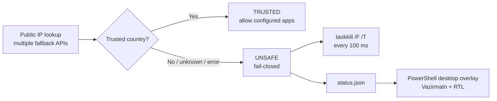
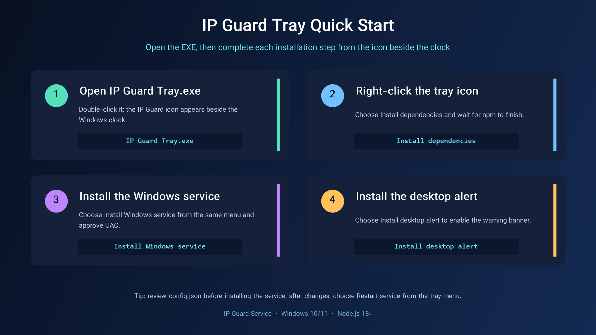

# IP Guard Service

> فارسی: [README.fa.md](README.fa.md)

IP Guard Service is a fail-closed Windows service that permits selected desktop applications to run only while the current public IP has been positively identified as belonging to a trusted country. It is designed for people who need to avoid accidental sign-ins from an unexpected network location after a VPN disconnects, reconnects, or changes exit location.

It is useful for applications such as Claude, ChatGPT, Perplexity, Cursor, and similar tools where an unintended IP/location change may create account-security or regional-consistency concerns. It does **not** bypass any provider restriction, conceal IP addresses, or guarantee that an account will not be suspended. You remain responsible for complying with each provider’s terms, local law, and account-security policies.

## What it does

- Runs as a real `IPGuardService` Windows service and starts automatically after boot.
- Resolves public IP and country through multiple fallback endpoints.
- Uses a fresh HTTP(S) connection for each lookup to recover cleanly after VPN adapter changes.
- Uses an allowlist: only countries in `trustedCountryCodes` are considered safe.
- Enforces **fail-closed** behavior: Iran, any untrusted/unknown country, API errors, timeouts, and no network all activate protection.
- Force-closes configured executables with `taskkill /F /T` and checks again every 100 ms while unsafe.
- Shows a compact, click-through desktop alert in the signed-in user session, separate from the Windows service.
- Provides an optional system-tray control menu for installation, service operations, status, logs, and alert management.
- Includes a bilingual Tray interface: Persian RTL and English LTR, with the selected language remembered per Windows user.
- Writes an atomic status file and concise logs; repeated lookup failures are not spammed into the log.

## Architecture

## Requirements

- Windows 10 or Windows 11
- Node.js 18 LTS or newer
- Administrator access to install/remove/restart the service
- PowerShell 5.1 or newer for the optional desktop alert and status viewer
- Internet access for IP-country lookup

## Install using only the Tray icon

You do not need to open the `.bat` files individually. Complete the normal setup from the menu on the icon beside the clock.

1. Before installing the service, edit [`config.json`](config.json) if needed and review `trustedCountryCodes` and `processesToKill`.
2. Double-click [`IP Guard Tray.exe`](IP%20Guard%20Tray.exe).
3. If the icon is not immediately visible beside the clock, open the `^` overflow area, then right-click the IP Guard icon.
4. Select **Install dependencies** and wait for its console window to report success.
5. Right-click the icon again and select **Install Windows service**. Approve the Windows Administrator request.
6. After installation, the menu should show `✓ Windows service: running`. Choose **Install desktop alert** if you also want the graphical warning banner.
7. **Show current status and log** displays the current state. Start, stop, restart, and removal are all available from the same menu.

Run [`install-tray-manager.bat`](install-tray-manager.bat) once if you also want the Tray app to start automatically at Windows sign-in.

Read the complete [English installation guide](docs/INSTALLATION.md) or [راهنمای نصب فارسی](docs/INSTALLATION.fa.md) before deploying this on a primary workstation.

## Visual quick start

The illustrated four-step guides are available in English and Persian:

## Video tutorial

Tray-based setup walkthrough: [▶ Watch the video online](https://github.com/mnikoie/ip-guard_service/raw/refs/heads/main/docs/videos/ip-guard-tray-setup.fa.mp4)

The link opens the video directly in the browser's video player; no download is required.

## About

Developed by **Seyed Mohammad Ali Nikoei**.

- Phone: [+98 913 267 5400](tel:+989132675400)
- Email: [m.nikoie2005@gmail.com](mailto:m.nikoie2005@gmail.com)

More details: [About and contact](docs/ABOUT.md).

## Configuration

Use [`config.example.json`](config.example.json) as a clean reference. `config.json` is the active configuration.

| Key | Description |
| --- | --- |
| `trustedCountryCodes` | ISO 3166-1 alpha-2 country codes that are allowed. Every other result is unsafe. |
| `processesToKill` | Exact executable names, e.g. `ChatGPT.exe`. |
| `checkIntervalMs` | Public-IP lookup interval. Default: `5000`. |
| `killIntervalMs` | Local enforcement interval while unsafe. Default: `100`. |
| `requestTimeoutMs` | Timeout applied to each lookup endpoint. Default: `5000`. |
| `ipApiEndpoints` | Lookup endpoints, tried in order. |
| `logFile` / `statusFile` | Service output paths. |

After changing `config.json`, run [`4-restart-service.bat`](4-restart-service.bat) as Administrator.

## Operations

| Task | Command / script |
| --- | --- |
| Install dependencies | `1-install-dependencies.bat` |
| Install service | `2-install-service.bat` (Administrator) |
| Start service | `start-service.bat` (Administrator) |
| Stop service | `stop-service.bat` (Administrator) |
| Restart service | `4-restart-service.bat` (Administrator) |
| Display current state | `5-view-log.bat` |
| Install desktop alert | `install-overlay.bat` |
| Remove desktop alert | `uninstall-overlay.bat` |
| Install tray control menu | `install-tray-manager.bat` |
| Remove tray control menu | `uninstall-tray-manager.bat` |
| Remove service | `3-stop-and-uninstall-service.bat` (Administrator) |
| Validate source | `npm test` |
| Run core manually | `npm start` |

The service status and logs are written under `C:\ProgramData\IPGuardService\`:

- `status.json` — current `TRUSTED` or `UNSAFE` state used by the overlay/viewer.
- `ipguard.log` — service events and successful process terminations.

## System-tray control menu

Double-click [`IP Guard Tray.exe`](IP%20Guard%20Tray.exe) to place a custom AI-protection icon in the Windows notification area (the area beside the clock; open the `^` overflow menu if Windows hides it). Then right-click it and complete the installation in this order: **Install dependencies**, **Install Windows service**, and **Install desktop alert**. All later actions—start/stop/restart, current status and log, removal, configuration, and opening the project folder—are also available from this menu. Operations that modify the Windows service show the normal UAC confirmation.

The **Language / زبان** submenu switches the Tray UI between English LTR and Persian RTL. The choice is retained for the next launch.

The menu checks the actual local state whenever it opens: `✓` means installed or active, `✕` means absent or inactive, and `!` means attention is needed (for example, the service is installed but stopped). Removing dependencies deletes only this project's `node_modules` folder; it never removes system-wide Node.js.

This is a notification-area icon rather than a pinned Taskbar button, because it stays available without a visible application window and supports a persistent right-click operations menu.

## Safety notes

- Initial startup is unsafe until a trusted lookup succeeds. Applications listed in `processesToKill` may therefore be terminated immediately when the service starts.
- Do not add Windows components, security software, shells, installers, or unsaved-work applications to `processesToKill`.
- A network outage is intentionally treated as unsafe. This prevents a gap in protection but can interrupt listed applications.
- The service contacts third-party IP-lookup providers. See [Privacy](docs/PRIVACY.md) for details.

## Documentation

- [Installation and operation](docs/INSTALLATION.md)
- [راهنمای نصب و استفاده](docs/INSTALLATION.fa.md)
- [Architecture](docs/ARCHITECTURE.md)
- [Troubleshooting](docs/TROUBLESHOOTING.md)
- [Privacy](docs/PRIVACY.md)
- [Security policy](SECURITY.md)
- [Contributing](CONTRIBUTING.md)
- [Changelog](CHANGELOG.md)
- [About and contact](docs/ABOUT.md)

## License

The project source is released under the [MIT License](LICENSE). Vazirmatn font files are included under the [SIL Open Font License 1.1](licenses/OFL-1.1.txt); see [third-party notices](THIRD_PARTY_NOTICES.md).
