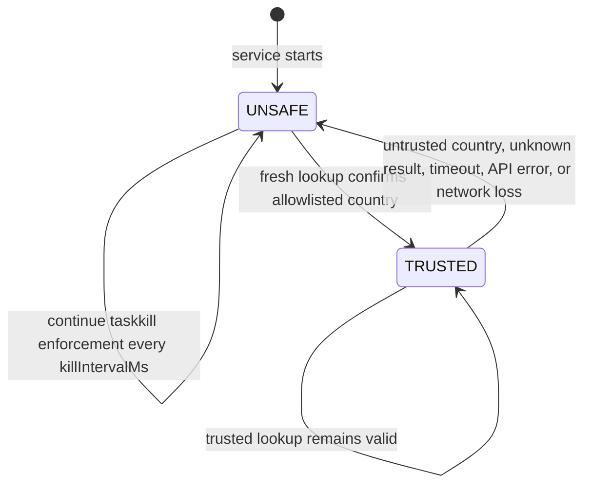

# Architecture

## Components

| Component | Runs as | Responsibility |
| --- | --- | --- |
| `index.js` | LocalSystem Windows service | Lookup public IP, make trust decision, enforce process policy, publish status and logs. |
| `config.json` | Project file | Defines allowlist, targets, timing, endpoints, and output paths. |
| `alert.ps1` | Signed-in user | Displays the desktop warning based on status only. It does not kill processes. |
| `5-view-log.bat` | Interactive user | Color-coded current-state viewer. |

## State machine



The `UNSAFE` default makes loss of country-verification information a security event rather than an allowed gap.

## Lookup resilience

Each endpoint is tried in configuration order. Every request uses `Connection: close` and newly created HTTP/HTTPS agents. This avoids reusing a stale keep-alive socket after a VPN adapter disappears or routing changes.

Only a valid, successful response containing both an IP and a two-letter country code can transition to `TRUSTED`—and only if that country is in `trustedCountryCodes`.

## Process enforcement

When state is `UNSAFE`, the service runs the equivalent of:

```text
taskkill /IM "<configured-name>.exe" /F /T
```

every `killIntervalMs`. A non-zero `taskkill` exit code caused by a missing process is expected and is not logged as an error. Successful termination produces `KILLED: <name>.exe` in the log.

## Desktop UI boundary

Windows services use Session 0 Isolation, so they must not attempt to draw directly on the signed-in user’s desktop. The service instead writes `status.json` atomically. `alert.ps1`, started at user logon, reads this file and displays/hides the alert bar.
