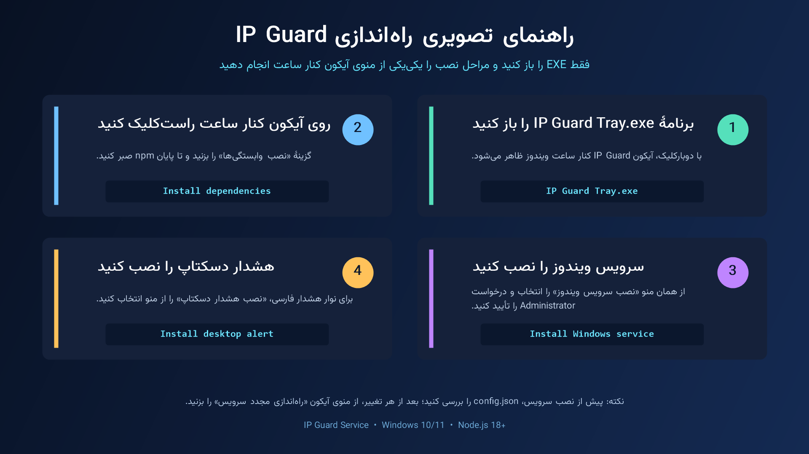

# راهنمای نصب و استفاده

## پیش از نصب

IP Guard تا وقتی با اطمینان ثابت نکند آی‌پی عمومی در کشور امن است، برنامه‌های فهرست‌شده را می‌بندد. قبل از نصب این موارد را در نظر بگیرید:

- فهرست کشورهای امن را بر اساس نیاز خودتان انتخاب کنید؛ به پیش‌فرض پروژه اکتفا نکنید.
- فقط برنامه‌هایی را وارد `processesToKill` کنید که بسته‌شدن اجباری آن‌ها خطر از دست‌رفتن کار ذخیره‌نشده ایجاد نمی‌کند.
- وضعیت اولیهٔ سرویس `UNSAFE` است و پس از اولین lookup موفق امن می‌شود؛ پیش از نصب برنامه‌های هدف را ببندید.
- سرویس را فقط روی سیستمی نصب کنید که Administrator آن هستید.

## آموزش تصویری سریع



## ۱. دریافت پروژه

مخزن را Clone کنید یا فایل ZIP را دریافت و Extract کنید:

```powershell
git clone https://github.com/<your-account>/ip-guard-service.git
cd ip-guard-service
```

آدرس نمونه را با آدرس مخزن خودتان جایگزین کنید.

## ۲. پیکربندی

در صورت نیاز به شروع تمیز، ابتدا فایل نمونه را کپی کنید:

```powershell
Copy-Item config.example.json config.json
```

سپس `config.json` را ویرایش کنید:

```json
{
  "trustedCountryCodes": ["US", "GB"],
  "processesToKill": ["ChatGPT.exe", "claude.exe", "Perplexity.exe"],
  "checkIntervalMs": 5000,
  "killIntervalMs": 100
}
```

کد کشور باید ISO دوحرفی باشد. نام exe را از ستون **Name** در Task Manager → Details بردارید.

## ۳. نصب وابستگی‌ها

[`1-install-dependencies.bat`](../1-install-dependencies.bat) را اجرا کنید یا در PowerShell بنویسید:

```powershell
npm install
npm test
```

`npm test` فقط ساختار و تنظیمات پروژه را بررسی می‌کند؛ سرویس را شروع نمی‌کند و هیچ برنامه‌ای را نمی‌بندد.

## ۴. نصب سرویس ویندوز

روی [`2-install-service.bat`](../2-install-service.bat) راست‌کلیک و **Run as administrator** را انتخاب کنید.

سرویسی با نام `IPGuardService` ساخته و اجرا می‌شود. وضعیت را از `services.msc` یا دستور زیر بررسی کنید:

```powershell
Get-Service IPGuardService
```

## ۵. نصب هشدار گرافیکی

[`install-overlay.bat`](../install-overlay.bat) را در هر حساب کاربری ویندوزی که باید هشدار را ببیند اجرا کنید. این فایل:

1. در صورت نبودن، Vazirmatn Regular و Bold را کنار فایل‌های پروژه دریافت می‌کند.
2. برای همان کاربر Startup shortcut می‌سازد.
3. `alert.ps1` را با پنجرهٔ PowerShell مخفی اجرا می‌کند.

Overlay فایل `C:\ProgramData\IPGuardService\status.json` را می‌خواند. جدا بودن آن از سرویس عمدی است، چون Windows Service در Session 0 نمی‌تواند رابط گرافیکی عادی روی Desktop کاربر نمایش دهد.

هشدار به شکل کارت کوچک پایینِ سمت راست نمایش داده می‌شود، click-through است و فوکوس کیبورد یا کلیک برنامه‌های دیگر را نمی‌گیرد.

## ۶. بررسی وضعیت

[`5-view-log.bat`](../5-view-log.bat) را اجرا کنید. این ابزار هر ثانیه فقط آخرین وضعیت را به‌روز می‌کند:

- **سبز / `TRUSTED`** — کشور امن تأیید شده و اجرای برنامه‌های هدف مجاز است.
- **قرمز / `UNSAFE`** — محافظت فعال است و برنامه‌های هدف اجباری بسته می‌شوند.
- **زرد** — فایل وضعیت هنوز در دسترس نیست یا در حال به‌روزرسانی است؛ اجرای سرویس را بررسی کنید.

فایل‌های مهم:

| فایل | کاربرد |
| --- | --- |
| `C:\ProgramData\IPGuardService\status.json` | تصمیم فعلی سرویس. |
| `C:\ProgramData\IPGuardService\ipguard.log` | تغییر وضعیت، اولین خطای lookup، recovery و Killهای موفق. |

## ۷. نصب اختیاری منوی Tray

برای اجرا، روی [`IP Guard Tray.exe`](../IP%20Guard%20Tray.exe) دوبارکلیک کنید. این برنامه بدون پنجرهٔ اضافی، آیکون اختصاصی «محافظ AI» را در Notification Area کنار ساعت ویندوز اجرا می‌کند. اگر آیکون نمایش داده نشد، منوی `^` کنار ساعت را باز کنید. برای اجرای خودکار در ورودهای بعدی ویندوز، یک بار [`install-tray-manager.bat`](../install-tray-manager.bat) را اجرا کنید تا shortcut همان کاربر ساخته شود.

با راست‌کلیک، عملیات نگه‌داری موجود را اجرا کنید. منو با هر بازشدن وضعیت سیستم را بازخوانی می‌کند: `✓` یعنی نصب یا فعال، `✕` یعنی نصب‌نشده یا غیرفعال و `!` یعنی نیازمند توجه. وابستگی‌ها فقط از پوشهٔ `node_modules` همین پروژه حذف می‌شوند و Node.js ویندوز حذف نخواهد شد. نصب، شروع، توقف، Restart و حذف سرویس فقط هنگام انتخاب همان گزینه، UAC درخواست می‌کنند؛ خود منوی Tray همیشه با دسترسی Administrator اجرا نمی‌شود.

برای نصب معمول، ترتیب درست در همان منو این است: **نصب وابستگی‌ها**، سپس **نصب سرویس ویندوز** و در پایان **نصب هشدار دسکتاپ**. منوی **زبان / Language** رابط Tray را میان فارسی RTL و English LTR تغییر می‌دهد و انتخاب را نگه می‌دارد.

برای حذف آیکون، [`uninstall-tray-manager.bat`](../uninstall-tray-manager.bat) را اجرا کنید.

## تغییر تنظیمات

1. `config.json` را ویرایش کنید.
2. [`4-restart-service.bat`](../4-restart-service.bat) را با Administrator اجرا کنید.
3. وضعیت را با `5-view-log.bat` دوباره بررسی کنید.

## حذف

1. [`3-stop-and-uninstall-service.bat`](../3-stop-and-uninstall-service.bat) را با Administrator اجرا کنید.
2. در هر حساب کاربری که Overlay نصب شده است، [`uninstall-overlay.bat`](../uninstall-overlay.bat) را اجرا کنید.

اسکریپت‌ها پوشهٔ `C:\ProgramData\IPGuardService\` را حذف نمی‌کنند تا لاگ و اطلاعات تشخیصی باقی بماند. اگر دیگر به آن‌ها نیاز ندارید، دستی حذفشان کنید.
